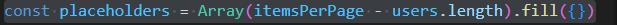

# Frontend-Beauty-Salon

##Objetivo.

El objetivo de este proyecto es crear la parte visual basada en una base de datos relacional creada previamente con diferentes endpoints y vistas de usuario y administrador.

## Tecnologías utilizadas:

    

## Detalles y pasos del proyecto

En esta parte frontal intentaré que toda la aplicación sea responsive, realizando tareas en endpoinds me he cruzado con bastantes problemas y uno de ellos es el siguiente:  

##Problemas y soluciones:

1. Realizando una llamada al backend la cual se encargaba de desactivar el usuario, me cruce con el problema de que al realiar la acción al realizarse primero la llamada a la api, los demás pasos de esa función no se llevaran a cabo.  
  

La solución que yo encontré fue la siguiente:  

Después de esta solución, el usuario ya puede: Registrarse, loguearse y des-loguearse,
modificar su perfil y contraseña, pedir una cita con día y horarios limitados por el Admin. Puede modificar citas escogiendo día, mes, hora, tratamiento a realizar y estilista que lo ejecute, también puede decidir borrarlas. El usuario cuando borra su perfil simplemente lo desactiva, es el admin el encargado de volver a activarlo o borrarlo definitivamente

2. Al finalizar la tabla de todos los usuarios, la paginación se desplazaba al final de la tabla, para solucionar esto pintaremos un array de filas vacías para no mover la paginación.
  
  
  

Resultado:  

3. Al filtrar por usuarios con citas para un estilista de la lista de usuarios totales, me he encotrado con que a la hora de filtrar la paginacion se descuadra porque alarga los usuarios hasta completar las paginas totales.